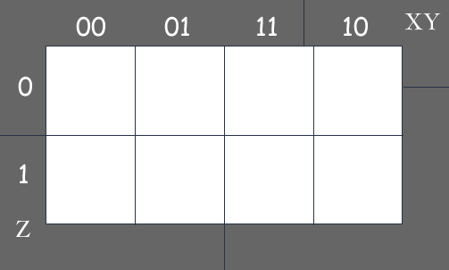
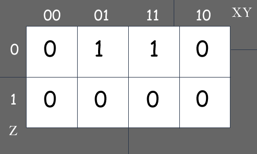
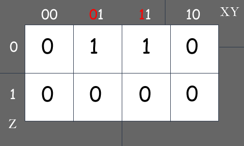

# Boolean Algebra

##Karnaugh Maps

Karnaugh maps use the minterms of a boolean expression to create a two dimensional grid in which each cell is labeled with bit string values that differ in exactly one literal. Each minterm in the boolean expression corresponds to a cell in the map. The labeling is called Grey Code and more specifically is a Hamilton Circuit in a n-Hypercube. The Karnaugh map may be used to simplify boolean statements by translating physical adjacency in the map to logical equivalence in the expression.

### Terminology  

A <code>literal</code> is a boolean variable or its complement.

A <code>minterm</code> is a product of n literals, one literal for each variable. A boolean expression with n variables has $$2^n$$ minterms. 

Product of sums, <code>POS</code>, is a boolean expression that comes in the form $$(x \wedge y) \lor \ldots \lor (\neg x \wedge y)$$ with **any combination** and **any number** of boolean **literals**. 

Sum of products, <code>SOP</code> is a boolean expression that comes in the form $$(x \lor y) \wedge \ldots \wedge (\neg x \lor \neg y)$$ with **any combination** of **any number** of boolean **literals.**

Any boolean expression can be expressed as a boolean sum of minterms. Each minterm is the product of boolean variables and their complements. The set, $$ \{ \dot, +, \neg \} $$ is <code>functionally complete</code> 

### Digital Circuits  

In terms of a digital circuits, product of sums contains only <code> AND gates </code> in the outermost level and sum of products contains only <code> OR gates </code> in the outermost level.

<code>SOP</code> outputs <strong>true</strong> if any input to the <code>OR gates</code> are <strong>true</strong> 

<code>POS</code> outputs <strong>false</strong> if any input to the <code>AND gates</code> are <strong>false</strong>

### Building a K-Map

Use a rectangle containing $$2^{\lfloor n/2\rfloor}$$ rows and $$2^{\lceil n/2\rceil}$$ columns since there are $$2^n$$ minterms and $$\lfloor n/2\rfloor + \lceil n/2\rceil = n$$

Label the rows in columns in a way that the minterms they represent are adjacent to minterms that differ in exactly one literal. In order to achieve this most easily we use Grey Code which assigns minterms to bit strings where boolean variables map to 1's and their complements map to 0's. In order to stay sane, creating an n-dimensional K-map it can be accomplished by prepending 1's and 0's to each minterm of the (n-1)-dimensional K-map.

Consider the Grey code for a 1-dimensional K-map 1,0 which correspond to $$x$$ and $$\neg x$$.
We can build a 2-dimensional map with the Grey code 11, 10, 01, 00 which correspond to $$xy$$, $$x\neg y$$, $$\neg x y$$, $$\neg x \neg y$$. The following diagram represents this 2-dimensional K-map.

### Using the Map

The basic idea is to identify the largest $$2^k$$ cell groupings of minterms that exist in the boolean expression (i.e. groupings of 1's in the map)

Compare adjacent midterms noting which literals differ in value. Each grouping may generate a product in the resulting SOP simplification which contain the literals that did not differ in value. The following shows how a comparison of literals is made.

### Example of POS simplification

$$ (\neg x + y + \neg z) * (x + y +\neg z) $$

First we must create a 3-dimensional K-map to address the eight minterms of this expression.

Each sum in the boolean expression must be converted to a bit string using Grey code. 010 represents $$ (\neg x + y + \neg z) $$ and 110 represents 
$$ (x + y +\neg z) $$. Label the cells of the map that are addressed by those minterms with 1.  

 

A comparison of a literal in one minterm to the next is shown in the following diagram.

The SOP simplification is a POS where each product is made of the literals that did not differ in value. The only $$2^k$$ cluster produces the product $$(y * \neg z)$$. Therefore the original, boolean expression is logically equivalent to this term. 

