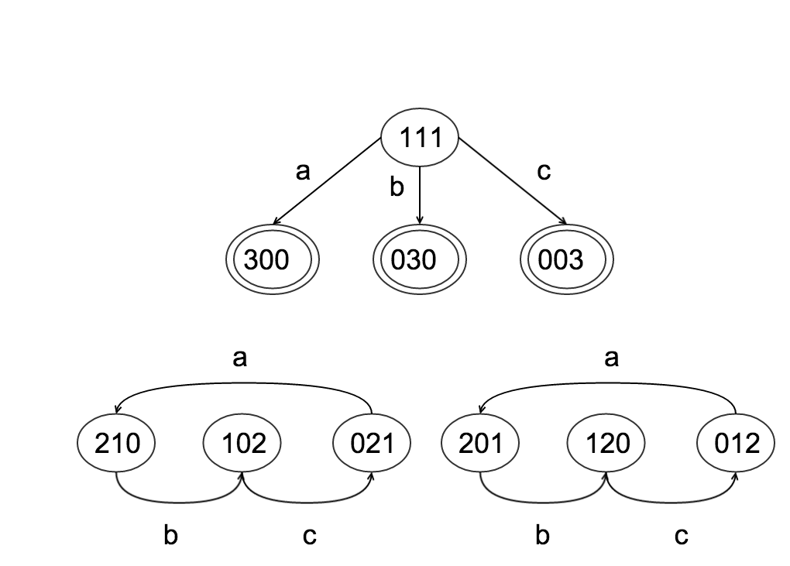
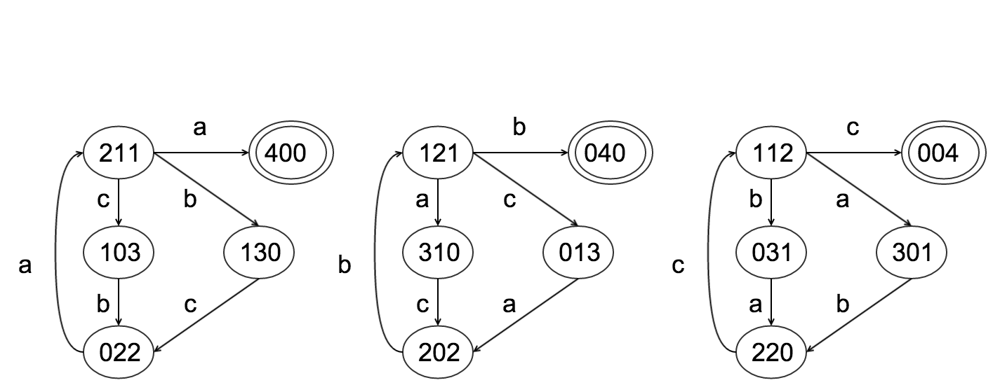
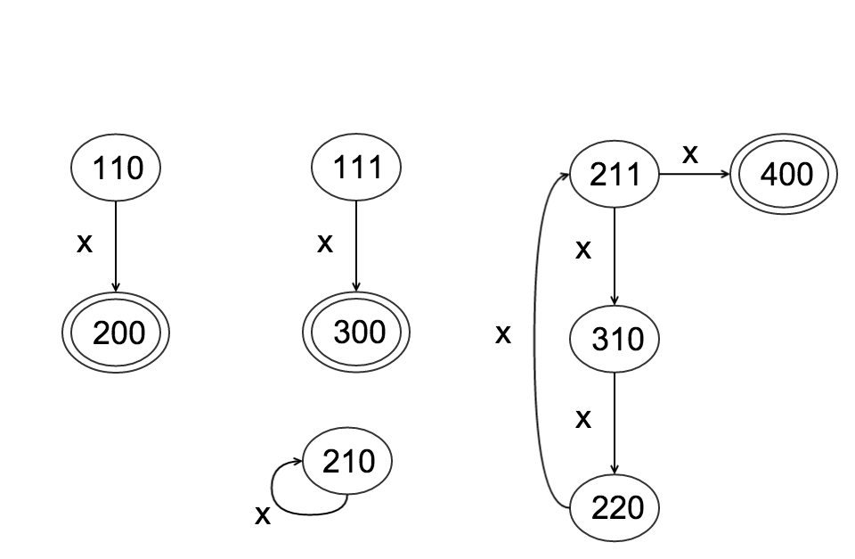

#Strange Planet

On a distant planet there are three species, a, b, and c.

Any two different species can mate. If they do the participants die.Two children of the third species are born.

The planet fails if all individuals are of the same species. A sequence of three integers represents the number of individuals of species a, b, and c respectively and is known as state. a-event occurs when individuals of species b and c breed and are replaced by two a's. Analogously b-events and c-events. events are represented by the symbols a, b, and c respectively.

Without symmetry, how many states are there with n individuals? 

$$
\sum_{x=1}^{n+1} x = \frac{(n+1)(n+2)}{2}
$$

How many states are there with n individuals with symmetry?

$$
f(n) =
\begin{cases}
\bigg\lfloor\frac{(n+1)(n+2)}{9}\bigg\rfloor + 1, & \text{if }n\mod 3 = 0 \\[2em]
\bigg\lfloor\frac{(n+1)(n+2)}{9}\bigg\rfloor, & \text{if }n\mod 3 \not= 0
\end{cases}
$$

For n individuals, how do you tell whether a state is must-fail, might-fail, or can't-fail? Terminal states are ”must-fail” states and are dictated by the rules. Cycles that contain no terminal elements have states that are all ”can’t-fail” states. If a path contains a terminal state and has no cycles all states in that path are ”might-fail” states. If a path contains a terminal state and has a cycle the elements of the path that are also members of the cycle and all states with paths to the cycle are ”might-fail” and the remaining states are ”must-fail”

___
Extra 

Total number of 2-tuples each possessing the property the sum of it's elements is equal to n. 
$$
n + 1
$$

Total number of distinct 2-tuples each possessing the property the sum of it's elements is equal to n.

$$
f(n) =

\bigg\lceil\frac{(n+1)}{2}\bigg\rceil

$$

